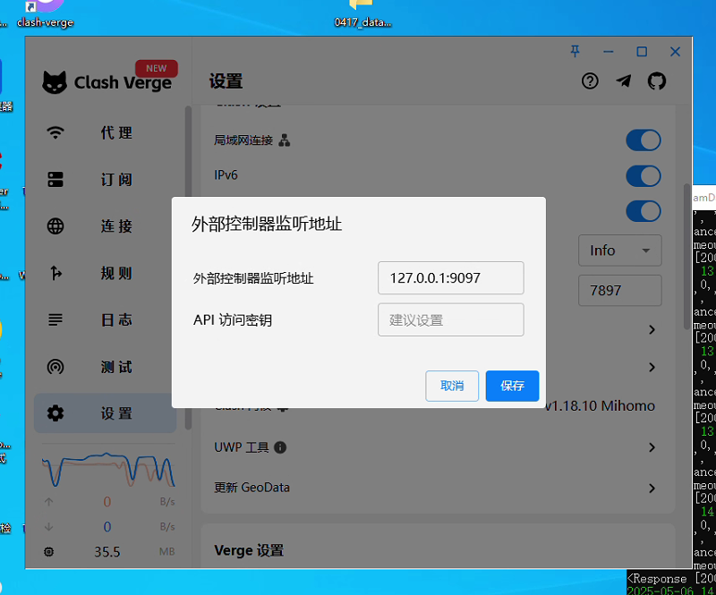

# ClashProxyPool
在python中使用clash节点作为代理池，自动切换

用法:
先打开外部控制,如果是当前机器,默认127.0.0.1就行,其他机器访问就改成0.0.0.0,与下面的clash_api对应.
允许局域网连接,混合端口一般就是7897

```python
from clash_proxy_pool import ClashProxyPool

pool = ClashProxyPool(
    clash_api="http://172.16.3.6:9097",
    secret=None, proxy_port=7897, max_fail=3,
    proxy_server="172.16.3.6"
)

response = pool.request(
    "GET",
    "https://www.baidu.com",
    headers={
        "user-agent": "Mozilla/5.0 (Windows NT 10.0; Win64; x64) AppleWebKit/537.36 (KHTML, like Gecko) Chrome/136.0.0.0 Safari/537.36 Edg/136.0.0.0"
    }
)
print(response)
```
